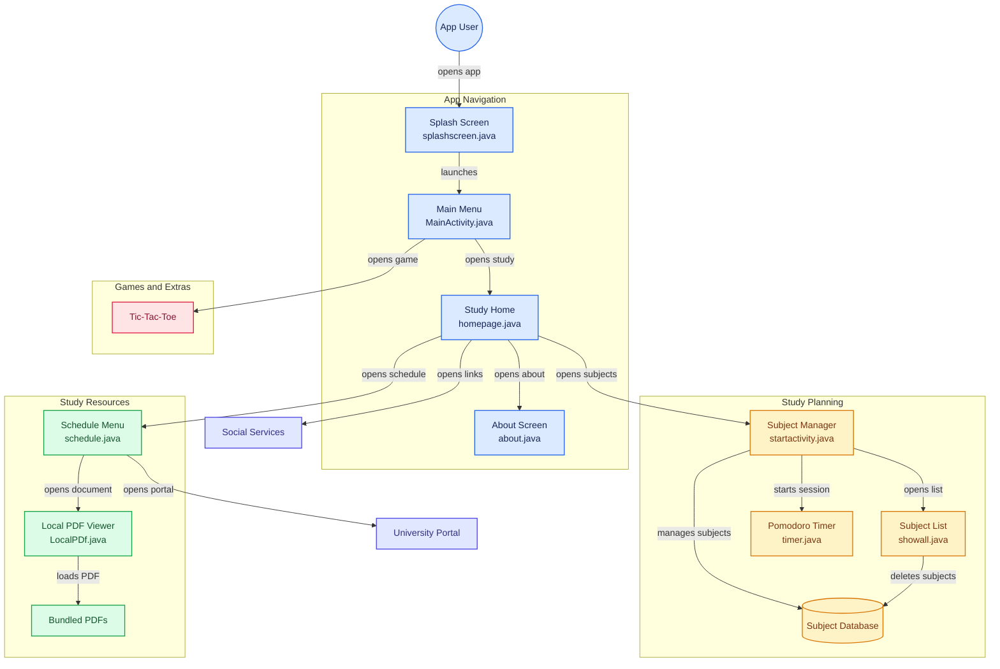

## App Architecture

```mermaid
flowchart TD

subgraph group_navigation["App Navigation"]
  node_splash["Splash Screen<br/>splashscreen.java"]
  node_main["Main Menu<br/>MainActivity.java"]
  node_home["Study Home<br/>homepage.java"]
  node_about["About Screen<br/>about.java"]
end

subgraph group_study["Study Planning"]
  node_subjects["Subject Manager<br/>startactivity.java"]
  node_sections[("Subject Database")]
  node_subjectlist["Subject List<br/>showall.java"]
  node_timer["Pomodoro Timer<br/>timer.java"]
end

subgraph group_resources["Study Resources"]
  node_schedule["Schedule Menu<br/>schedule.java"]
  node_pdf["Local PDF Viewer<br/>LocalPDf.java"]
  node_assets["Bundled PDFs"]
end

subgraph group_extras["Games and Extras"]
  node_game["Tic-Tac-Toe"]
end

node_user(("App User"))
node_social["Social Services"]
node_ums["University Portal"]

node_user -->|"opens app"| node_splash
node_splash -->|"launches"| node_main
node_main -->|"opens study"| node_home
node_main -->|"opens game"| node_game
node_home -->|"opens subjects"| node_subjects
node_home -->|"opens schedule"| node_schedule
node_home -->|"opens about"| node_about
node_home -->|"opens links"| node_social
node_schedule -->|"opens portal"| node_ums
node_schedule -->|"opens document"| node_pdf
node_pdf -->|"loads PDF"| node_assets
node_subjects -->|"manages subjects"| node_sections
node_subjects -->|"opens list"| node_subjectlist
node_subjectlist -->|"deletes subjects"| node_sections
node_subjects -->|"starts session"| node_timer

click node_splash "https://github.com/yassakamille/todoro/blob/main/app/src/main/java/com/apps/todoro/splashscreen.java"
click node_main "https://github.com/yassakamille/todoro/blob/main/app/src/main/java/com/apps/todoro/MainActivity.java"
click node_home "https://github.com/yassakamille/todoro/blob/main/app/src/main/java/com/apps/todoro/homepage.java"
click node_about "https://github.com/yassakamille/todoro/blob/main/app/src/main/java/com/apps/todoro/about.java"
click node_schedule "https://github.com/yassakamille/todoro/blob/main/app/src/main/java/com/apps/todoro/schedule.java"
click node_pdf "https://github.com/yassakamille/todoro/blob/main/app/src/main/java/com/apps/todoro/LocalPDf.java"
click node_assets "https://github.com/yassakamille/todoro/tree/main/app/src/main/assets"
click node_subjects "https://github.com/yassakamille/todoro/blob/main/app/src/main/java/com/apps/todoro/startactivity.java"
click node_sections "https://github.com/yassakamille/todoro/blob/main/app/src/main/java/com/apps/todoro/SubjectDBHelper.java"
click node_subjectlist "https://github.com/yassakamille/todoro/blob/main/app/src/main/java/com/apps/todoro/showall.java"
click node_timer "https://github.com/yassakamille/todoro/blob/main/app/src/main/java/com/apps/todoro/timer.java"
click node_game "https://github.com/yassakamille/todoro/blob/main/app/src/main/java/com/apps/todoro/Regisration_Activity.java"

classDef toneNeutral fill:#f8fafc,stroke:#334155,stroke-width:1.5px,color:#0f172a
classDef toneBlue fill:#dbeafe,stroke:#2563eb,stroke-width:1.5px,color:#172554
classDef toneAmber fill:#fef3c7,stroke:#d97706,stroke-width:1.5px,color:#78350f
classDef toneMint fill:#dcfce7,stroke:#16a34a,stroke-width:1.5px,color:#14532d
classDef toneRose fill:#ffe4e6,stroke:#e11d48,stroke-width:1.5px,color:#881337
classDef toneIndigo fill:#e0e7ff,stroke:#4f46e5,stroke-width:1.5px,color:#312e81
classDef toneTeal fill:#ccfbf1,stroke:#0f766e,stroke-width:1.5px,color:#134e4a

class node_splash,node_main,node_home,node_about,node_user toneBlue
class node_subjects,node_sections,node_subjectlist,node_timer toneAmber
class node_schedule,node_pdf,node_assets toneMint
class node_game toneRose
class node_social,node_ums toneIndigo
```

